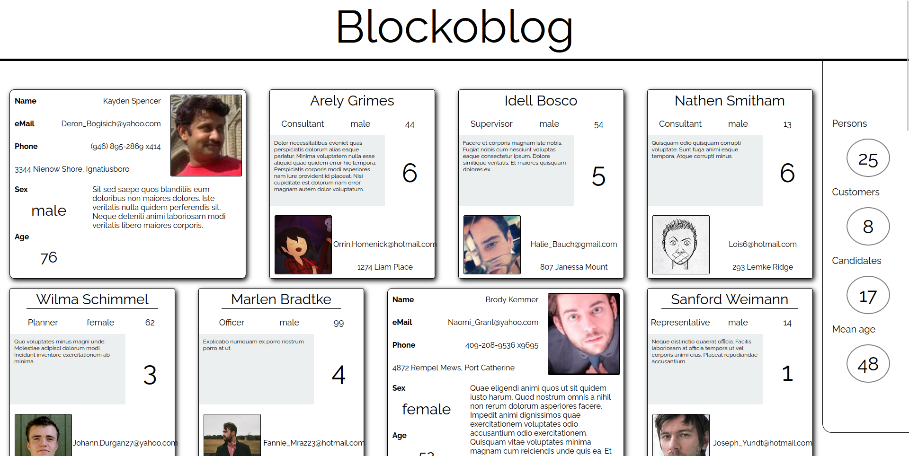
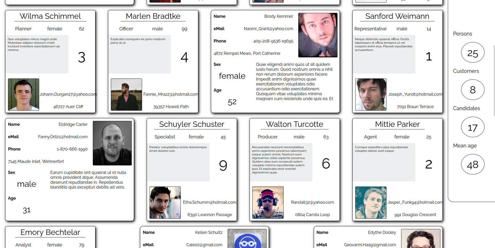
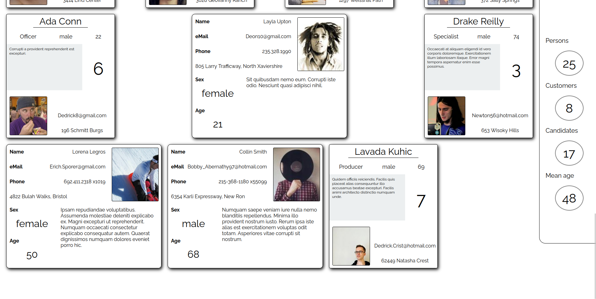

# First Challenge: Posicionamiento y maquetación básica de bloques

## Introducción

El objetivo de este reto es trabajar el posicionamiento de elementos en pantalla, de forma absoluta y los unos respecto a los otros. La página a maquetar consiste de una serie de tarjetas que contienen dos tipos distintos de usuarios del sistema: clientes y candidatos. Cada una de las tarjetas tiene su propio diseño, que habrá que implementar, aparte del diseño básico de la página.

En esta página se valorará que el diseño sea mínimamente adaptativo, i.e.: se espera que funcione en dispositivos con anchos de página de 800px en adelante.

Como en el resto de retos, se proporcionará un archivo SCSS básico con los nombres de las clases generales, con bordes negros y colores de fondo para facilitar su reconocimiento en pantalla.

## Descripción

Las siguientes pantallas muestran la aplicación ya maquetada:



La pantalla se compone de tres elementos:

- Un título que ocupa la parte superior de la página
- Una sección de estadísticas sobre los datos que ocupa la parte derecha de la misma. Esta sección es sticky, i.e.: al llegar a la parte superior de la pantalla acompaña el scroll de la misma.



- Una parte central que muestra un listado de tarjetas de dos tipos distintos. En la última fila del listado, los elementos aparecerán justificados a la izquierda.



Los textos de las tarjetas han sido generados automáticamente, y podŕian no respetar los tamaños reales; en los casos en los que el texto supere el tamaño disponible, se deberá cortar.

Los tamaños absolutos en pixels no son relevantes para la calificación, únicamente las relaciones generales entre los elementos.

## Evaluación

En esta prueba se evaluarán los siguientes objetivos:

- 3p - Posicionamiento y estructura general de la página
- 5p - Estructura de los elementos de las tarjetas
- 1p - Limpieza del código
- 1p - Maquetación general de la página

## Generación de datos

_Esta parte de la documentación es opcional y se proporciona para referencias futuras_

El proyecto contiene una herramienta de generación de datos que se puede ejecutar con el siguiente comando:

```
yarn generate
```

No se recomiendo generar muchos datos ni muy frecuentemente, puesto que el servidor de imágenes aleatorias puede restringir el acceso
ante un número elevado de peticiones. Se proveerá un ZIP con imágenes predescargadas para evitar el ruido que pueda causar la generación
de datos.
