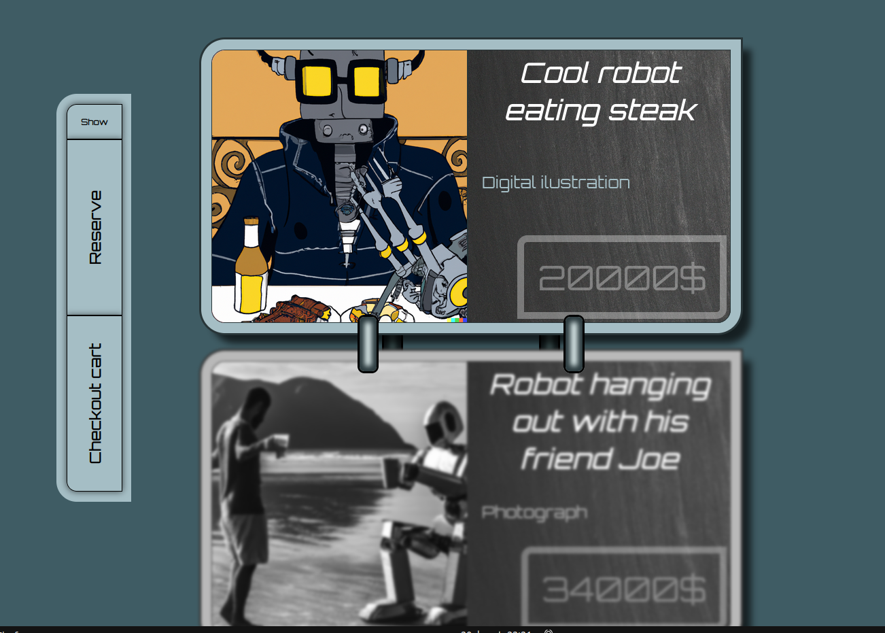
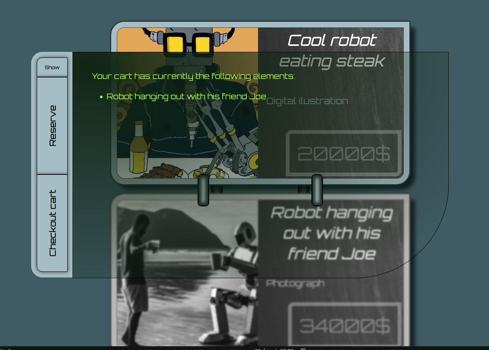

# First Challenge: Posicionamiento y maquetación básica de bloques

## Introducción

El objetivo de este reto es trabajar el uso de bordes y sombreados, el uso de efectos visuales en los elemento y el posicionamiento de unos elementos sobre otros en el flujo de dibujado.

Esta maquetación se probará únicamente en un ancho de 1400px (o superior). No se requiere que sea adaptativa.

Como en el resto de retos, se proporcionará un archivo SCSS básico con los nombres de las clases generales, con bordes negros y colores de fondo para facilitar su reconocimiento en pantalla.

## Descripción

El siguiente enlace de vídeo muestra un ejemplo de funcionamiento de la aplicación:

[Ejemplo de funcionamiento](img/aparienciaGeneral.mp4)

Las siguientes imágenes muestran una instantanea de la aplicación terminada:

La pantalla se compone de dos secciones, un listado de ilustraciones y una botonera, con las siquientes características:

- Cada una de las ilustraciones contiene, aparte de la ilustración en sí, un título, un par de notas descriptivas y un precio

- Al pasar el ratón por las ilustraciones, éstas se iluminan en su totalidad

- Al pulsar sobre una de las ilustraciones, se añade al carrito de la compra. Las ilustraciones añadidas al carrito aparecen en blanco y negro y ligeramente difuminadas

- Las ilustraciones están unidas por dos "remaches metálicos" uno de ellos superpuesto a las ilustraciones y otro que aparece por debajo.

- Al pulsar el botón "Show" se muestra un visor con el estado actual del carrito, como se muestra en la siguiente slide. Este visor es transparente, y se muestra por encima del listado, con un gradiente oscuro.

- El resto de botones no tienen funcionalidad

Los tamaños absolutos en pixels no son relevantes para la calificación, únicamente las relaciones generales entre los elementos.

## Evaluación

En esta prueba se evaluarán los siguientes objetivos:

- 3p - Posicionamiento y estructura general de la página
- 3p - Bordes y formas de las cajas
- 1p - Efectos visuales 
- 1p - Limpieza del código
- 1p - Maquetación general de la página
