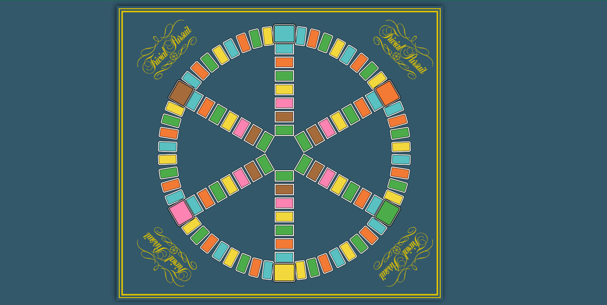

# Third Challenge: Posicionamiento absoluto, transformaciones y estructuras de control

## Introducción

El objetivo de este reto es trabajar:

* los posicionamientos de elementos globales en la página
* las transformaciones de elementos
* las estructuras de control de SASS, para evitar la repetición de código

Esta maquetación se probará únicamente en todos los anchos superiores al tamaño horizontal del tablero (1000px).

Como en el resto de retos, se proporcionará un archivo SCSS básico con los nombres de las clases generales, con bordes negros y colores de fondo para facilitar su reconocimiento en pantalla.

## Descripción

Las siguientes imagen muestran una instantanea de la aplicación terminada:

Como se puede comprobar, la pantalla es simplemente un tablero de Trivial Pursuit (los equipos que terminen la implementación básica son libres de adornarla con ).

## Evaluación

En esta prueba se evaluarán los siguientes objetivos:

- 5p - Posicionamiento y estructura general de la página
- 4p - Limpieza del código
- 1p - Maquetación general de la página
